# Ignite PoC Demo Guide

This guide is a presenter-focused runbook for demonstrating the current Apache Ignite PoC with two independent cache stores:

- Salesforce-backed read-through cache (`userDetails`)
- Postgres-backed read-through cache (`postgresUserDetails`, mock loader)

## 1) Demo Objective

Show how Apache Ignite can:

1. Run as a distributed in-memory data grid client.
2. Use read-through cache loading from external systems.
3. Keep external integrations modular and maintainable by separating provider-specific code.

## 2) Foundational Elements (What to Explain)

### A. Ignite node and discovery

- `IgniteQuickStart` starts an Ignite **client node**.
- Discovery is configured with `TcpDiscoveryMulticastIpFinder` and loopback range `127.0.0.1:47500..47509`.
- `peerClassLoading` is enabled so custom task/cache classes can be shared with server nodes.

Why this matters in demo:
- You can connect to existing server nodes while keeping app startup lightweight.

### B. Core cache concepts shown

- `myCache` demonstrates plain put/get in-memory behavior.
- `userDetails` and `postgresUserDetails` demonstrate read-through cache loading.
- On first miss, Ignite invokes cache store `load(key)`.
- On next get for same key, value is served from cache (no new external fetch until eviction/expiry).

Why this matters in demo:
- Demonstrates low-latency repeated reads with clean fallback to source-of-truth loaders.

### C. Read-through CacheStore pattern

Both providers follow the same maintainable shape:

1. Provider client interface (`...client/...Client`)
2. Provider config (`...config/...Config`)
3. Provider model (`...model/...UserDetails`)
4. Provider cache store (`...store/...CacheStore`)

Why this matters in demo:
- You can add/replace data sources without changing Ignite orchestration logic.

### D. Separation of concerns

Salesforce and Postgres live in separate packages:

- `com.example.ignitepoc.salesforce.*`
- `com.example.ignitepoc.postgres.*`

Why this matters in demo:
- Each connector can evolve independently (auth, retries, real DB calls, schema mapping).

### E. Mock-first behavior for reliable demos

- Salesforce client returns mock user when env configuration is missing.
- Postgres loader currently uses `MockPostgresUserClient` and returns deterministic demo users plus fallback mock records.

Why this matters in demo:
- Demo always works without depending on live external systems.

## 3) Current Runtime Flow (Step by Step)

1. App starts and configures Ignite.
2. `myCache` receives `Hello`/`World!` values and prints retrieval.
3. Salesforce cache (`userDetails`) is configured with read-through store.
4. `userCache.get(...)` triggers `SalesforceUserCacheStore.load(...)` on miss.
5. Returned `SalesforceUserDetails` is printed.
6. Postgres cache (`postgresUserDetails`) is configured with read-through store.
7. `postgresUserCache.get("pg-100")` triggers `PostgresUserCacheStore.load(...)` and returns mock data.
8. `postgresUserCache.get("pg-admin")` returns mock data derived from Postgres config.
9. Compute task broadcasts to server nodes and prints node/runtime info.
10. Ignite node closes.

### Runtime Flow Diagram

```mermaid
flowchart TD
    A[Start IgniteQuickStart] --> B[Build IgniteConfiguration]
    B --> C[Load SalesforceConfig from env]
    C --> D[Create HttpSalesforceClient]
    D --> E[Start Ignite client node]

    E --> F[Create myCache]
    F --> G[Put values: 1=Hello, 2=World!]
    G --> H[Get and print myCache values]

    H --> I[Configure Salesforce cache userDetails]
    I --> J{Get Salesforce user}
    J -->|Cache miss| K[SalesforceUserCacheStore.load]
    K --> L[Fetch from Salesforce or mock]
    L --> M[Return SalesforceUserDetails]
    M --> N[Store in cache + print loaded user]
    N --> O{Get Salesforce user again}
    O -->|Cache hit| P[Return cached SalesforceUserDetails]

    P --> Q[Configure Postgres cache postgresUserDetails]
    Q --> R{Get Postgres user pg 100}
    R -->|Cache miss| S[PostgresUserCacheStore.load]
    S --> T[MockPostgresUserClient fetch]
    T --> U[Return PostgresUserDetails]
    U --> V[Store in cache + print user]

    V --> W{Get Postgres user pg admin}
    W -->|Cache miss| X[PostgresUserCacheStore.load]
    X --> Y[MockPostgresUserClient fetch]
    Y --> Z[Return + print user]

    Z --> AA[Broadcast RemoteTask to server nodes]
    AA --> AB[Server nodes print runtime info and read myCache]
    AB --> AC[Close Ignite node]
    AC --> AD[End]
```



## 4) Demo Script (Suggested Talk Track)

### Phase 1: Architecture (1-2 min)

Say:
- "This PoC shows one Ignite client app with two separate read-through cache stores, one for Salesforce and one for Postgres."
- "Both connectors use the same pattern: client + config + model + cache store."

### Phase 2: Run the app (1 min)

```bash
mvn clean package
mvn -q -DskipTests exec:java
```

### Phase 3: Explain console output (3-4 min)

Call out these milestones:

1. `>> Created the cache and add the values.`
2. `>> Get values from cache: Hello World!`
3. `>> Loading user details for userId: ...` (Salesforce loader invoked)
4. `>> Salesforce user loaded: ...`
5. `>> Loading user details from Postgres cache store for userId: pg-100`
6. `>> Postgres user loaded (mock): ...`
7. `>> Executing the compute task`

### Phase 4: Maintainability message (1-2 min)

Say:
- "The separation makes this easy to productionize incrementally."
- "We can replace mock loaders with real integrations without changing the Ignite flow in `IgniteQuickStart`."

## 5) Configuration Notes

### Salesforce env vars

- `SF_BASE_URL`
- `SF_API_VERSION` (default: `v59.0`)
- `SF_AUTH_TOKEN`
- `SF_USER_ID` (default: `005000000000000`)

If these are absent, mock Salesforce response is used.

### Postgres env vars

- `POSTGRES_HOST` (default: `localhost`)
- `POSTGRES_PORT` (default: `5432`)
- `POSTGRES_DB` (default: `ignite_demo`)
- `POSTGRES_USER` (default: `ignite_user`)

Current implementation uses mock Postgres client for demo consistency.

## 6) Foundational Q&A Cheat Sheet

### Q: Why read-through instead of preloading everything?

A: Read-through loads data on demand, lowering startup cost and loading only what is actually used.

### Q: Why two separate cache stores?

A: External systems have different auth, APIs, and schemas; separate modules reduce coupling and simplify maintenance.

### Q: How to move from mock to real Postgres?

A: Keep `PostgresUserClient` interface and swap `MockPostgresUserClient` with JDBC implementation, no change needed in cache store contract.

### Q: What does Ignite add here beyond direct API calls?

A: In-memory caching, read-through abstraction, and distributed execution with consistent access patterns across nodes.

## 7) Source Map (Where to Navigate During Demo)

- App orchestration: `src/main/java/com/example/ignitepoc/IgniteQuickStart.java`
- Salesforce module: `src/main/java/com/example/ignitepoc/salesforce/`
- Postgres module: `src/main/java/com/example/ignitepoc/postgres/`
