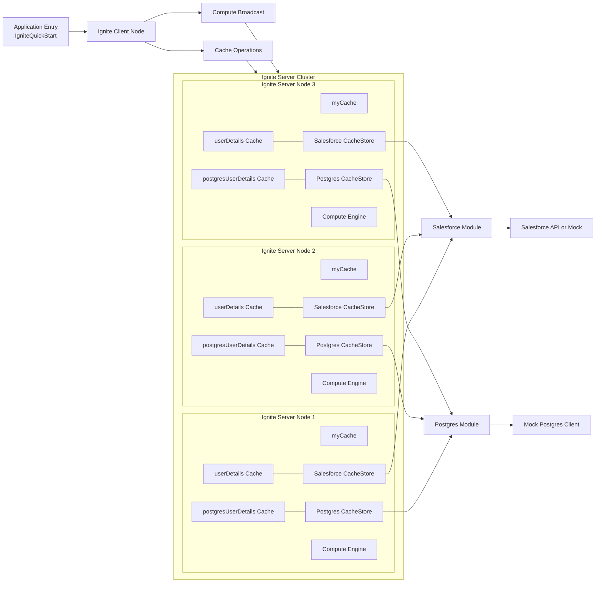

# Ignite PoC High-Level Block Diagram

This diagram gives a clean overview of the PoC architecture for presentations.

## Presenter Notes

- The app runs as an Ignite client node.
- The client node only sends cache requests and compute broadcasts.
- All server-owned components are inside the Ignite Server Cluster.
- Each server node contains myCache, read-through caches, cache stores, and compute engine.
- Salesforce and Postgres modules are reached through server-side cache stores.
