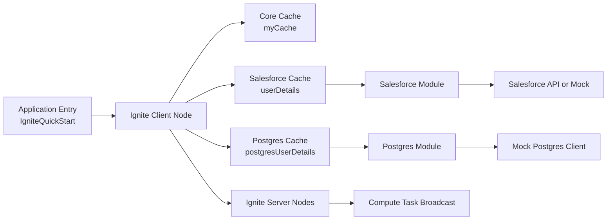

# Ignite PoC High-Level Block Diagram

This diagram gives a clean overview of the PoC architecture for presentations.

## Presenter Notes

- The app runs as an Ignite client node.
- `myCache` shows in-memory cache behavior.
- `userDetails` and `postgresUserDetails` show read-through cache integration.
- Provider-specific logic is isolated in separate Salesforce and Postgres modules.
- Compute tasks run on Ignite server nodes.
