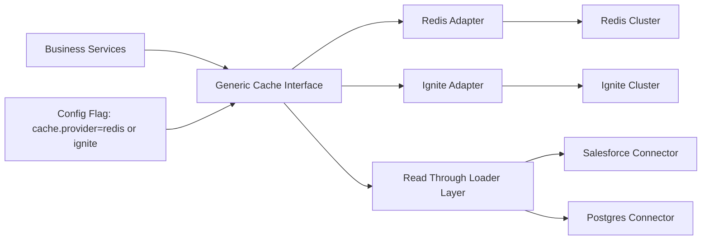

# Cache Platform Decision Playbook

## Purpose

Provide leadership with a decision framework to evaluate whether to:

1. Continue with Redis as the strategic cache platform, or
2. Adopt Apache Ignite for selected workloads.

This document combines business outcomes, cost considerations, technical tradeoffs, risks, and a practical path forward after this PoC.

## Executive Summary

- The current PoC demonstrates that Ignite can support read-through caching with modular connectors and token-aware integration patterns.
- Redis remains a strong default for simple key/value caching and lower operational complexity.
- Ignite becomes attractive when workload needs include distributed compute, richer data-grid capabilities, SQL-style querying over cache data, and co-located processing patterns.
- Recommendation: do not force a full-platform switch immediately. Use a phased strategy with a generic cache abstraction so the application can run on Redis now and adopt Ignite later for targeted domains with minimal code churn.

## Current State (Baseline)

- Production baseline in the original project: Redis cache.
- PoC baseline in this repo: Ignite client + read-through cache stores for Salesforce and Postgres modules.
- PoC includes split-token data-fetch pattern simulation (OAuth path for Id/Name and service-token path for Email) and mock mode for demo reliability.

## Business Decision Framing

### What leadership needs to decide

- Is cache strategy purely latency + cost optimization?
- Or does the platform need to evolve into a broader in-memory data and processing layer?

### Decision guardrails

- Prefer lowest total cost and risk for the next 6–12 months.
- Avoid lock-in to one cache implementation in application code.
- Ensure migration path does not delay roadmap delivery.

## Redis vs Ignite: Leadership Comparison

| Dimension | Redis (current) | Ignite (PoC candidate) | Leadership interpretation |
|---|---|---|---|
| Simplicity | Very high | Medium | Redis wins for speed of team onboarding |
| Operational overhead | Lower | Higher | Ignite likely needs stronger platform SRE support |
| Typical latency use-case | Excellent for standard cache patterns | Excellent for distributed data-grid patterns | Both can meet low-latency goals with proper design |
| Data model/query flexibility | Strong key/value and data structures | Strong in-memory data grid + SQL-like patterns | Ignite helps when query/compute needs grow |
| Compute near data | Limited | Strong | Ignite advantage for compute-heavy scenarios |
| Ecosystem familiarity | Usually broad | Team-dependent | Training cost likely higher for Ignite |
| Migration complexity from today | Minimal (stay) | Moderate (new cluster + operations model) | Phased adoption recommended |
| Strategic upside | Mature cache tier | Potential data + compute platform | Ignite value depends on future architecture goals |

## Cost Model (Leadership Lens)

Use a two-horizon view instead of a single snapshot:

### Horizon 1: Next 2 quarters

- Redis likely lower cost-to-run and lower change risk.
- Ignite introduces initial setup/training/operational costs.
- Recommendation for Horizon 1: keep Redis as default for existing workloads.

### Horizon 2: 12–24 months

Ignite may become cost-effective if multiple conditions are true:

- Significant growth in cache data complexity and cross-key query requirements.
- Increasing need for distributed compute close to data.
- Reduction of separate systems by consolidating some data-grid/compute concerns.

### Cost components to track in pilot

- Infra/runtime cost per environment.
- Platform engineering and SRE support effort.
- Developer productivity impact (delivery speed, incident rate).
- Performance under realistic traffic and failover tests.

## Technical Findings from PoC

### What is proven

- Read-through cache pattern works with modular provider design.
- Integration boundaries are clear (`client`, `config`, `model`, `store`).
- Token-sensitive field loading can be implemented in a controlled way.
- Mock-first mode supports stable demonstrations and local development.

### What is not yet proven

- Production-grade failover behavior under load.
- End-to-end security hardening and secret rotation practices in runtime.
- Operational runbooks (backup/restore, upgrades, autoscaling, incident playbooks).
- Real TCO under production SLO and throughput patterns.

## Challenges and Risks

### Business and delivery risks

- Team ramp-up time for Ignite operations and troubleshooting.
- Potential roadmap delays if migration scope is broad.
- Decision fatigue if success criteria are not quantified upfront.

### Technical risks

- Added architectural complexity if both Redis and Ignite are used without abstraction.
- Cross-environment parity issues if local/demo differs too much from production.
- Token/security flows must be centralized and auditable.

### Mitigations

- Introduce a generic cache abstraction now.
- Keep provider-specific logic isolated in adapters.
- Use phased rollout with explicit kill-switch and rollback path.
- Define measurable success criteria before expansion.

## Recommended Approach After This PoC

### 1) Keep Redis as default in current production flow

- No immediate disruption to business roadmap.
- Continue to capture current operational baseline metrics.

### 2) Introduce a Generic Cache Layer in application architecture

Design application code to depend on a cache interface rather than Redis/Ignite APIs directly.

#### Proposed contract (conceptual)

- `CacheProvider` interface (get, put, invalidate, bulk-get optional)
- `ReadThroughLoader` contract for source-of-truth fetching
- `CachePolicy` for TTL/refresh and key strategy
- `CacheTelemetry` hooks for hit rate/latency/error metrics

#### Adapter pattern

- `RedisCacheProvider` implementation (default runtime)
- `IgniteCacheProvider` implementation (pilot/runtime selectable)
- Runtime selection via config flag, not business-code changes

### 3) Run targeted Ignite pilot for one bounded domain

Candidate pilot profile:

- Read-heavy workload
- Clear SLO targets
- Limited blast radius
- High benefit from richer cache semantics

### 4) Use stage-gated scale decision

Promote Ignite only if pilot meets pre-agreed thresholds (performance, reliability, supportability, and total effort).

## Proposed Architecture Direction (Generic Cache First)

Leadership takeaway: this model reduces strategic risk because platform choice becomes a deployment/runtime decision rather than a deep application rewrite.

## Evaluation Scorecard for Leadership Review

Score each category 1–5 during pilot:

- Business impact (latency, customer experience, feature velocity)
- Delivery impact (team productivity, complexity)
- Operational fitness (incident frequency, recovery time)
- Security/compliance fit (secrets, auditability, controls)
- Financial impact (infra + people + support)

Suggested decision rule:

- Continue Redis-only if Ignite pilot score is not materially better in at least 3 of 5 categories.
- Adopt hybrid (Redis default + Ignite for select workloads) if Ignite shows clear technical value with acceptable ops overhead.
- Consider broader Ignite expansion only after two successful bounded pilots.

## 90-Day Action Plan

### Days 0–30: Foundation

- Define success metrics and decision thresholds.
- Add generic cache interface and Redis adapter in the main app.
- Add observability for cache hit ratio, p95/p99 latency, error rates.

### Days 31–60: Pilot

- Implement Ignite adapter behind feature flag.
- Pilot one workload in non-production/perf environment.
- Execute failure drills and operational runbook validation.

### Days 61–90: Decision

- Compare Redis baseline vs Ignite pilot metrics.
- Produce leadership review using scorecard and TCO snapshot.
- Decide one of: stay Redis, hybrid pattern, or broader Ignite investment.

## Presentation Flow (Leadership Meeting)

Use this flow to present in 20–30 minutes:

1. Context and objective (2 min)
   - Why this decision now and what success looks like.
2. What the PoC proved (4 min)
   - Modular read-through design and token-aware integration.
3. Business and cost view (6 min)
   - Horizon 1 vs Horizon 2 cost and delivery implications.
4. Technical tradeoffs and risks (6 min)
   - Redis simplicity vs Ignite capability and ops complexity.
5. Recommendation (5 min)
   - Generic cache abstraction + phased pilot plan.
6. Ask from leadership (2 min)
   - Approve 90-day pilot with explicit go/no-go criteria.

## Leadership Ask

Request approval for:

- A generic cache abstraction implementation in the main application.
- A bounded Ignite pilot (one domain, defined SLOs, rollback ready).
- A formal review checkpoint after 90 days for final platform direction.

## Appendix: Talking Points for Q&A

- “Are we replacing Redis now?”
  - No. Immediate strategy is risk-controlled: Redis stays default while architecture is made provider-agnostic.

- “What is the biggest risk if we choose Ignite too early?”
  - Added operational complexity before clear business value is proven in production-like conditions.

- “What is the biggest risk if we do nothing?”
  - Future platform flexibility may be constrained if cache logic remains tightly coupled to one provider.

- “How do we avoid rework?”
  - Implement the generic cache interface once; swap providers via adapters and configuration.
