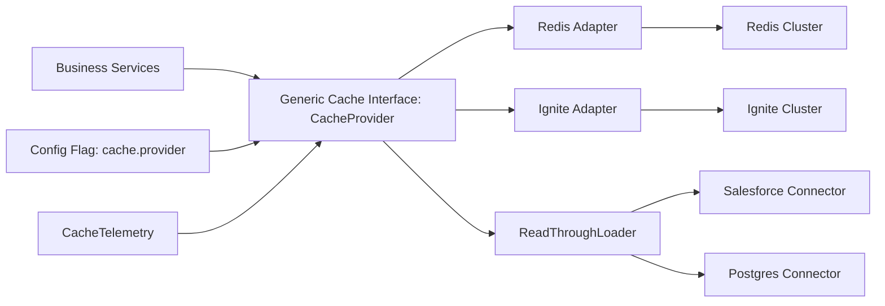

# Redis vs Apache Ignite — (Based on Current PoC)

## Decision to Make
Choose the cache platform direction for the next 6–24 months:
- **Option A:** Stay Redis-first as strategic default.
- **Option B:** Adopt Ignite for selected workloads via phased rollout.

## What the Current PoC Proves (and Does Not)
**Proven in this repo:**
- Ignite read-through caching works with modular adapters (Salesforce + Postgres).
- Connector isolation pattern is clean (`client`, `config`, `model`, `store`) and maintainable.
- Token-aware data loading pattern is demonstrated for Salesforce fields.
- Distributed compute broadcast capability is demonstrated.

**Not yet proven in this repo:**
- Redis-vs-Ignite benchmark under equal production load.
- Production failover/SRE runbook maturity for Ignite in your environment.
- Full TCO under real traffic, SLOs, and on-call model.

## Comparison Factors
| Dimension | Redis | Ignite | Takeaway |
|---|---|---|---|
| Time-to-value | Fastest | Medium | Redis is lower-friction for immediate roadmap delivery |
| Team onboarding | Lower training effort | Higher ramp (cluster + data grid concepts) | Redis wins short-term productivity |
| Operational complexity | Lower | Higher | Ignite needs stronger platform/SRE ownership |
| Data/compute capability | Strong cache features | Broader in-memory data grid + co-located compute | Ignite wins where compute-near-data matters |
| Architecture flexibility | Good | Very good for advanced distributed patterns | Ignite upside is strategic, not automatic |
| Migration risk from current state | Low | Moderate | Hybrid path reduces risk |

## Business, Cost, and Delivery Lens
Evaluate in two horizons:
- **0–6 months:** Redis is typically lower cost/risk due to existing familiarity and simpler operations.
- **6–24 months:** Ignite can justify cost if workloads need richer query/compute semantics and consolidation of data+compute patterns.

Track these cost drivers explicitly:
- Infrastructure runtime per environment.
- Platform/SRE support effort.
- Incident frequency and MTTR impact.
- Developer velocity impact (feature lead time).
- Security/compliance overhead (secrets, auditability, controls).

## Recommendation
- **Near term:** Keep Redis as default for existing production paths.
- **Strategic move now:** Introduce a provider-agnostic cache interface (`CacheProvider`) with Redis and Ignite adapters.
- **Pilot Ignite only for one bounded domain** with high read volume and clear value from richer in-memory capabilities.
- **Gate expansion by evidence, not preference.**

## Generic Cache Interface Flow (How Hybrid Works)

### Runtime flow
1. Business services call `CacheProvider` (never Redis/Ignite SDK directly).
2. `CacheProvider` implementation is selected by config flag (`cache.provider=redis|ignite`).
3. On cache hit, value is returned immediately.
4. On miss, `ReadThroughLoader` fetches from source systems (Salesforce/Postgres), then writes back to selected provider.
5. Telemetry records hit-rate, latency, and error metrics uniformly across providers.

### Architecture view

**Why this matters:** platform choice becomes a runtime decision with minimal business-code change and lower migration risk.

## Go/No-Go Scorecard (1–5 each)
- Business impact (latency/customer experience)
- Delivery impact (developer productivity)
- Operational fitness (stability, recovery)
- Security/compliance fit
- Financial impact (infra + people + support)

---
**Evidence basis in this repo:** Ignite PoC app flow, demo guide, and decision playbook documentation. This is a strategy recommendation, not a benchmark verdict.